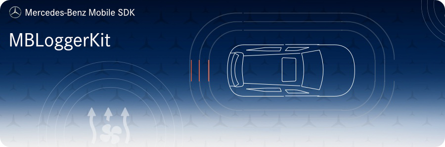

<!-- SPDX-License-Identifier: MIT -->



 


## Requirements
* __Minimum Android SDK:__ MBLoggerKit requires a minimum API level of 19. 
* __Compile Android SDK:__ MBLoggerKit requires you to compile against minimum API level 27.

## Intended Usage

⚠️ //TODO// Describe your example! Eg: This project is made for cooking the best Tiramisu. It works best with high quality ingredients and the best tools. Please describe your project as accurately and concisely as possible to help others understand your use case.

## Installation

Add the following maven url to your project `build.gradle`:  
```gradle
allprojects {
    repositories {
        google()
        jcenter()
        maven {
            url 'https://pkgs.dev.azure.com/daimler-ris/sdk/_packaging/release/maven/v1'
        }
    }
}
```

Add to your app's `build.gradle`:  
```gradle
implementation "com.daimler.mm:MBLoggerKit:$mb_logger_kit_version"
```

## Contributing

We welcome any contributions.
If you want to contribute to this project, please read the [contributing guide](CONTRIBUTING.md).

## Code of Conduct

Please read our [Code of Conduct](https://github.com/Daimler/daimler-foss/blob/master/CODE_OF_CONDUCT.md) as it is our base for interaction.

## License

This project is licensed under the [MIT LICENSE](LICENSE).

## Provider Information

Please visit <https://mbition.io/en/home/index.html> for information on the provider.

Notice: Before you use the program in productive use, please take all necessary precautions,
e.g. testing and verifying the program with regard to your specific use.
The program was tested solely for our own use cases, which might differ from yours.
